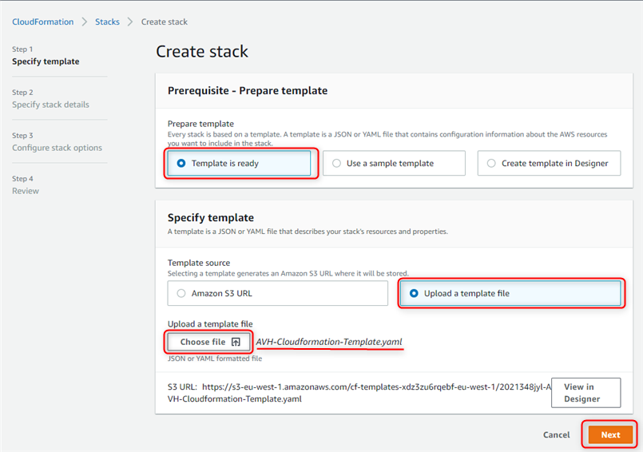
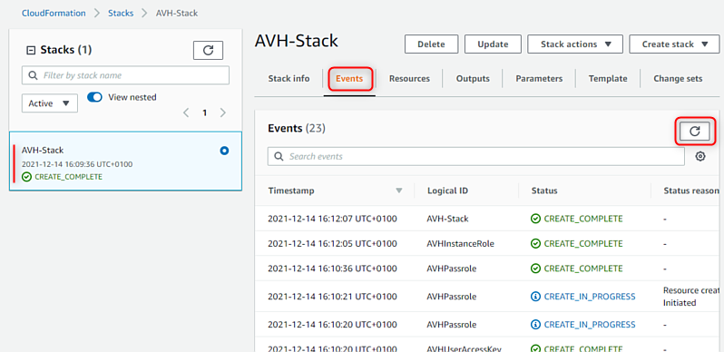
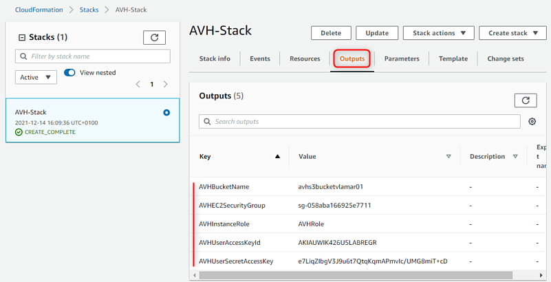

# AVH-AWS-Infra-CloudFormation
AVH CloudFormation for AVH AMI

This template creates the basic AWS infrastructure items required for using an Arm Virtual Hardware (AVH) Amazon Machine Image (AMI) with a [GitHub-hosted Runner](https://arm-software.github.io/VHT/main/infrastructure/html/run_ami_github.html#GitHub_hosted).

## Prerequisites
* AWS account
* Subscription to [AVH AMI](https://arm-software.github.io/VHT/main/infrastructure/html/index.html#Subscribe)

## What it creates
* One S3 Bucket (to store temporary files)
* One EC2 Security Group (to be associated with the EC2 instances)
* One IAM User and Access Keys (to limit access rights in the AWS)
* One IAM Role (to be associated with the EC2 Instances)

## CloudFormation inputs
* S3 Bucket Name
* VPC ID to be associated with the EC2 Security Group

## CloudFormation outputs
* Access Key ID
* Secret Access Key

The Access Key Id and corresponding Secret Access Key enable remote access for the AWS IAM User that gets created with this CloudFormation template.

## How to run it for the first time
1. Sign in with your AWS account on [aws.amazon.com](https://aws.amazon.com/) to land on AWS Management Console page.

2. Download [AVH-Cloudformation-Template.yaml](./AVH-Cloudformation-Template.yaml) file to your computer.

3. Type `Cloudformation` in the search and proceed to the corresponding AWS service page.

4. Click the _Create stack_ button.

5. Select _Template is ready_ option, and then _Upload a template file_.

6. With the _Choose file_ button select the `AVH-Cloudformation-Template.yaml` file in your local computer.

7. Click _Next_.

Markdown image

HTML image

8. Specify stack details as follows:
    - _Stack name_: use any name, for example `AVH-Stack`.
    - _S3BucketName_: shall have only small letters and numbers and be unique across AWS, as otherwise stack creation will fail later.
    - _Vpcid_: provide VPC ID for your target region. This can be found in VPC AWS service.

9. On _Configure stack options_ page keep default values and press _Next_.

10. On _Review_ page:
    - Acknowledge that a new AWS IAM User and AWS IAM AccessKey will be created.
    - Press _Create stack_.

11. The infrastructure described in the template file will be provisioned. In _Events_ tab you can follow the creation process. Use _refresh_ button if the page does not get updated automatically. After a few minutes the stack creation should be successfully completed.

13. Go to the created stack and in the _Output_ tab, find the values for the parameters needed for using an AVH AMI:
    - `AVHBucketName`: lists the name of created S3 bucket. It is same as provided in step 8.
    - `AVHEC2SecurityGroup`: contains the name of created EC2 security group.
    - `AVHInstanceRole`: provides the name of created IAM Instance Profile.
    - `AVHUserAccessKeyId`: 
    - `AVHUserSecretAccessKey`: 

Note that when the cloud stack is not needed anymore CloudFormation service can be also used to easily delete the stack including all the provisioned resources.
